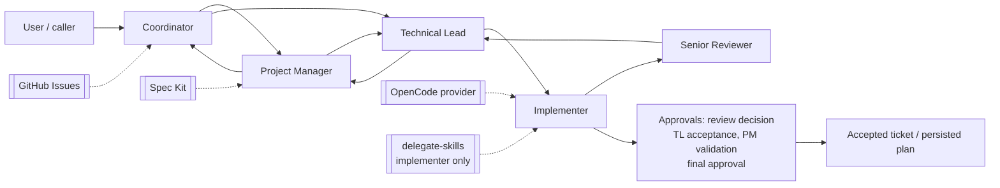

# AI Team Framework — Project Guide

**The authoritative usage guide for version 0.3.0.** Everything below
was verified against the released implementation: executable source
code, actual CLI behavior, configuration schemas, automated tests, and
live npm registry metadata. Where behavior could not be verified, the
guide says so explicitly.

- Package: `@moassaad/ai-team-framework@0.3.0` (`latest` on npm)
- Guide version: 0.3.0 · last verified against the `v0.3.0` release tree
- This file (`docs/PROJECT_GUIDE.md`) is repository documentation: it
  ships with the GitHub repository, not inside the npm tarball (which
  contains only `dist/`, `LICENSE`, `package.json`, `README.md`).

## Table of contents

1. [Project overview](#1-project-overview)
2. [Installation and prerequisites](#2-installation-and-prerequisites)
3. [Mental model and architecture](#3-mental-model-and-architecture)
4. [Roles](#4-roles)
5. [CLI reference](#5-cli-reference)
6. [Workflows end to end](#6-workflows-end-to-end)
7. [Configuration reference](#7-configuration-reference)
8. [Practical use cases](#8-practical-use-cases)
9. [Approval, safety, and operational boundaries](#9-approval-safety-and-operational-boundaries)
10. [Troubleshooting and FAQ](#10-troubleshooting-and-faq)
11. [Limitations and current maturity](#11-limitations-and-current-maturity)
12. [Development and contribution](#12-development-and-contribution)
13. [Reference](#13-reference)

## 1. Project overview

AI Team Framework coordinates five specialized AI roles — Coordinator,
Project Manager, Technical Lead, Implementer, Senior Reviewer —
working one ticket at a time on **any** software project. Your project
keeps its own language, architecture, and tooling; the framework never
imposes any of these. It contributes process: explicit role contracts,
validated handoffs between roles, approval gates before acceptance,
and persisted plans under your project's `.ai-team/` directory.

**Intended users:** solo developers who want review discipline,
small teams planning and delivering features, and operators who need
every AI decision to be explicit, validated, and traceable.

**Main capabilities (implemented and verified):**

- Five role contracts with independent execution (`ai-team role`).
- Canonical, validated role-to-role handoffs (manual copy/paste).
- New-project and existing-project planning workflows producing
  approved, persisted Sprint/Task plans.
- FAST / STANDARD / FULL feature lifecycles (implement → review →
  accept across increasing ceremony).
- Explicit PM/TL planning approvals, reviewer decisions, TL
  acceptance, PM user-testing validation, final approval.
- Correction and re-entry contracts; user-checkpoint
  request/resolution contracts.
- Project setup, discovery analysis, work-mode recommendation with
  guardrails.
- Optional integrations: OpenCode (execution), GitHub Issues
  (tracking), Spec Kit (specification), delegate-skills
  (implementer-only delegation).

**Boundaries:** the framework writes only inside `<project>/.ai-team/`
(plus the single plan file it persists there); it never edits your
source, never scaffolds applications, never auto-approves, never
retries silently, and never runs the whole team from a single role
command.

## 2. Installation and prerequisites

- **Node.js ≥ 18** (engines field; framework runs on 18+).
- **npm** 9+ for installation.
- No credentials, services, or providers needed for install and
  contract inspection. Real execution needs a working provider (see
  §9); GitHub-backed `run`/`sprint` need a token plus GitHub config.

**Install from npm** (verified via isolated-prefix install of the
exact published version; system-global `-g` linking uses the same
standard npm mechanism but was not executed against the live global
environment):

```bash
npm install -g @moassaad/ai-team-framework@0.3.0
```

**Verify:**

```bash
ai-team --version   # 0.3.0
ai-team --help      # usage text, exit 0
```

**Checkout alternative** (for contributors or pre-release use):

```bash
git clone https://github.com/moassaad/ai-team-framework.git
cd ai-team-framework
npm install
npm run build
node dist/index.js --version
```

**Minimal quick-start** (no configuration needed — presentation only):

```bash
ai-team run --role coordinator      # prints the Coordinator contract
ai-team run "/technical-lead"       # prints the Technical Lead contract
ai-team role                        # prints role-command usage
```

Role selection presents contracts (`Role execution is not implemented
yet` there). Real execution is covered in §4–§6.

## 3. Mental model and architecture

Work flows **ticket → role → handoff → next role → approval → done**.
The Coordinator routes; PM owns business scope; TL owns technical
planning and decomposition; the Implementer changes code for one
ticket; the Senior Reviewer advises without modifying code. Every
transfer is a validated `AgentHandoff` (`from`/`to`/`objective` plus
optional context, requirements, acceptance criteria, constraints,
artifacts, notes, next action). Approvals are explicit caller/user
decisions recorded by authority (PM, TL, Reviewer, Coordinator) —
never inferred from report text.



State lives in `<project>/.ai-team/` (`config.yaml` plus
`roles/ workflows/ state/ specs/ plans/ reviews/ reports/ logs/`).
`AGENTS.md` files are **not** managed by the framework — the repo's
own `AGENTS.md` governs framework development, and setup never
creates or overwrites guidance files in your project. GitHub Issues,
when configured, supplies managed tickets to production `run` (one
ticket: list once, run once, synchronize once) and `sprint`
(one traversal with per-stage explicit decisions); the GitHub token
arrives on stdin and review decisions are never assumed.

Internal implementation detail (not a public API — there is no
`exports` map; deep `dist/` imports are checkout-only paths): the
TypeScript functions behind the workflows (`runProjectSetup`,
`runNewProject`, `runExistingProject`, lifecycle entry points) live
under `src/runtime/` and `src/config/`. **The CLI is the supported
public interface.**

## 4. Roles

Source of truth: `src/roles/operating-model.ts` (identities,
`ROLE_AUTHORITY`, `APPROVED_HANDOFFS`) and `src/roles/selection.ts`
(aliases `pm`, `tl`, `reviewer`, `sr`).

### Coordinator — workflow and orchestration authority

Receives requests, routes work, reports status. `ai-team role
coordinator` runs one production ticket: ticket starts `ready`
(fixed), staffing from `--specialty`, review decision explicit
(`--review-decision approved` | `--review-decision changes_requested
--review-feedback "..."`; TTY prompt fallback; safe failure without
one). Success: `role coordinator completed: ticket T-001 ->
<final_state>.` It never performs PM/TL planning, implementation, or
final approval itself.

### Project Manager — requirements, scope, and business authority

Business planning (workflow APIs) and, via the role command, PM
user-testing validation of one ticket in a state (`--state`, e.g.
`pm_review`). The role command is validation, not planning. Reports
`role project-manager completed.` plus the report text.

### Technical Lead — technical architecture and decomposition authority

Technical planning and task decomposition (workflow APIs) and, via
the role command, post-implementation technical-approval review of
one ticket in a state (`--state`, e.g. `technical_approval`). The
role command is acceptance review, not planning. Reports `role
technical-lead completed.` plus the report text.

### Implementer — implementation authority within approved scope

Implements exactly one ticket: `--id/--title/--description/
--requirements` plus `--specialty` (`backend|frontend|integration|
database|testing|documentation`). One provider attempt, no retry;
never invents missing acceptance criteria. Success: `role implementer
completed: ticket T-001 -> implementation_review.`

### Senior Reviewer — implementation review authority

Reviews one implementation result (`--result` plus ticket flags);
advisory report only, never modifies code, never reruns the
Implementer, and its text never authorizes acceptance. Success prints
the report after `role senior-reviewer completed: ticket T-001.`

**Example** (run from inside a configured project; production calls
go through the OpenCode provider):

```bash
ai-team role implementer --id T-001 --title "Render the list" \
  --description "Server-render saved articles newest first." \
  --requirements "Saved articles appear in reverse-chronological order" \
  --specialty backend
```

Missing/invalid inputs fail with bounded exit-1 errors (`missing
required --title`, `unknown specialty`, `unknown workflow state`,
`unsupported flag`). Configuration is validated before any provider
work; without `.ai-team/config.yaml` every role command fails first
with `Configuration file not found`.

## 5. CLI reference

All commands verified against `--help` and the parsers. Exit 0 on
success, exit 1 on bounded errors (usage/error text on stderr).

| Command | Purpose | Key options |
| --- | --- | --- |
| `ai-team --help` / `-h` | Usage text | — |
| `ai-team --version` / `-V` | `0.3.0` | — |
| `ai-team run` | One production Coordinator ticket (GitHub issues + stdin token) | `--review-decision approved\|changes_requested`, `--review-feedback` |
| `ai-team run --role <role>` | Present a role contract (no execution) | `--specialty` (implementer only) |
| `ai-team run "<prompt>"` / `"/<slash>"` | Role selection by text/slash | — |
| `ai-team role <role> [inputs]` | Execute exactly one role | Per-role flags + `--show-handoff`, `--handoff-stdin` |
| `ai-team sprint` | One production sprint traversal | `--review-decision`, `--tl-decision`, `--pm-decision`, `--final-decision` (+ `--review-feedback` as needed) |
| `ai-team status` | Read-only integration status (cwd = project root) | — |
| `ai-team setup <integration> [--yes]` | Explain → confirm → install/configure one integration once | `--yes` confirms explicitly |

Manual handoff: append `--show-handoff` to print exactly the
canonical handoff (or `no handoff available...` instead of inventing
one); resume via `--handoff-stdin` (piped/pasted text + EOF) **plus**
the destination's required flags — the handoff authorizes and travels
as provenance, inputs are never merged. Malformed text, empty stdin,
and destination mismatch (`handoff addresses "X" and cannot authorize
independent Y execution`) fail exit 1 before any provider work.
Unknown commands/roles print usage (exit 1).

## 6. Workflows end to end

- **Project setup** (`runProjectSetup`, TS API — no setup CLI):
  validates the root, ensures `.ai-team/` + `config.yaml` via
  canonical defaults, validates the result. Outcomes: `completed` /
  `already-configured` (safe no-op) / `invalid-configuration` (kept
  byte-for-byte with diagnostics — you repair it) / `failed`. Never
  touches source or guidance files.
- **New project:** setup → `runNewProject` (Coordinator → PM → TL
  planning, three-section artifact, explicit PM+TL approvals,
  Sprint/Task decomposition, persistence + readback to
  `.ai-team/plans/<id>.json`). `completed` carries the plan path;
  `changes-required` stops safely; `failed` names the stage.
- **Existing project:** setup → `validateProjectContext({root, name,
  kind:"existing"})` → `generateProjectAnalysis` (real detectors;
  findings are `detected`/`not_detected`/`unknown` with coverage
  metadata — only `detected` are facts) → `runExistingProject`
  (analysis bound to the same root for persistence). Source stays
  byte-identical; wrong `kind` throws; unreadable roots fail at
  `discovery` before any planning.
- **Feature lifecycles:** FAST (implementer → reviewer; failure
  blocks review; rejection never re-invokes), STANDARD (coordinator
  → TL → implementer → reviewer), FULL (planning approvals +
  acceptance gates + final approval). Wrappers fix their mode and
  delegate to the engines exactly once; `changes-required` is never
  completion.
- **Modes:** `recommendMode` suggests, `checkModeGuardrails`
  validates, **you** select — a recommendation is never execution
  authorization.
- **Corrections/re-entry:** reviewer/TL/PM/final findings become
  `CorrectionReference`s (verbatim feedback + explicit action),
  role-specific rework handoffs, and `ReentryRequest`s (mismatches
  rejected). Nothing auto-reruns; completion needs fresh explicit
  decisions.
- **User checkpoints:** `createUserCheckpoint` /
  `resolveUserCheckpoint` — pending-request contract only
  (`proceed`/`request-changes`/`stop`, matched by id + stage).
  Missing responses never approve; generic confirmation never
  becomes a role approval; no pause/resume, no UI.
- **Delegate:** implementer-destination transport only
  (`dispatchHandoff` → opaque receipt; wrong destinations fail
  `unsupported`; failures keep kind/message). `createManualFallback`
  returns copy/paste continuation that executes nothing. The manual
  path works with Delegate down. Skill install (explicitly
  confirmed): `npx skills add amElnagdy/delegate-skills --skill
  <skill> [--agent <agent>] [--global] -y` (Skills CLI needs Node
  ≥ 22.20; framework itself runs on 18+); enablement via
  `providers.delegate.enabled`; `ai-team status` for detection.

## 7. Configuration reference

Location: `<projectRoot>/.ai-team/config.yaml`. Validation is strict:
unknown keys rejected; run setup again after edits (expect
`already-configured`).

```yaml
version: 1                      # required, only 1 supported
approval:
  mode: manual                  # manual | automatic (default manual)
  after: ticket                 # ticket | sprint (sprint semantics deferred)
  sensitive_changes: always     # always | configured | never
  sensitive_rules: []           # used only when configured
workflow:
  execution: sequential         # only supported value
  default_state: ready
providers:
  opencode: { enabled: true }   # required first-class provider
  speckit: { enabled: false }   # optional
  github: { enabled: false }    # optional; when true requires owner, repo, managedLabel, specialty
  delegate: { enabled: false }  # optional; never auto-enabled
```

Minimal valid file: `version: 1` alone (defaults fill the rest).
Common mistakes: unknown top-level/provider keys, enabling `github`
without its four required fields, expecting `after: sprint` to do
something, editing generated metadata instead of these keys. Never
put secrets in config or handoffs.

## 8. Practical use cases

Each scenario lists when to use it, steps, expected result, and
limits. Walkthroughs marked *(illustrative)* show realistic but
hand-assembled flows; command outputs marked *(verified)* were
executed against the implementation.

1. **Solo developer, existing repo** — setup → `status` → discover
   → plan one improvement → implement via lifecycle. Limit: you
   still write PM/TL inputs yourself.
2. **Small team feature delivery** — existing-project planning with
   both approvals → FULL lifecycle → final approval. Limit: each
   gate needs its explicit decision up front or at a TTY.
3. **Bug fix with review checkpoint** — FAST lifecycle on a ticket;
   reviewer rejection returns `changes-required`, never a silent
   second attempt. *(verified result shapes)*
4. **Narrow single-role task** — `ai-team role senior-reviewer ...
   --result ...` for a one-off review. Limit: report is advisory.
5. **Delegated implementation** — capability check (`ready`) →
   dispatch implementer handoff → opaque receipt → continue
   manually on failure. Limit: implementer only; stub-proven flow,
   real relay needs an installed skill.
6. **Recovery after failed review** — correction reference →
   rework handoff → re-entry validation → explicit re-approval.
   Limit: nothing resumes automatically.
7. **New project conventions** — setup on an empty dir → new-project
   planning → persisted plan as the working agreement. Limit: no
   application code is generated, ever.

## 9. Approval, safety, and operational boundaries

- Default is **manual** approval at ticket granularity; `automatic`
  mode and `configured` sensitive-change rules exist but every
  recorded decision still names its authority.
- Requiring explicit user input: integration setup/install,
  `--yes` confirmations, review/approval/TTY decisions, checkpoint
  resolutions, `global`-scope skill installs.
- Role permissions: each role exercises only its scoped authority
  (§4); cross-role work travels by validated handoff, never by
  another role acting unilaterally.
- Repository writes: `.ai-team/` only (+ the single plan file);
  providers run bounded, shell-free probes; install runs the
  verified Skills CLI form, project scope by default, never sudo,
  never credential provisioning.
- Secrets: GitHub token via stdin only; nothing credential-like in
  config, handoffs, logs, or reports (enforced by tests).
- **Not guaranteed:** model output quality, complete repository
  understanding (see coverage metadata), real-integration
  availability, or release-grade verification of external tools.

## 10. Troubleshooting and FAQ

- `Configuration file not found` → run from inside the configured
  project or run setup first; the CLI uses cwd as project root.
- `invalid-configuration` (setup) → edit `config.yaml` yourself
  (unknown keys are the usual cause) and re-run; setup never
  repairs it for you.
- Usage errors (`unsupported flag`, `missing required --...`,
  `unknown specialty/state/role`) → compare against §4–§5; each
  role takes different flags.
- `no handoff available` → that execution carries none; copy nothing.
- Handoff resume failures → re-copy the complete canonical text
  (exact grammar, correct destination); never hand-edit role ids.
- `changes-required` / `failed` results → adjust inputs or fix the
  named cause and re-run; there is no retry flag.
- Provider errors → check OpenCode installation and
  `providers.opencode.enabled`; GitHub `run`/`sprint` need the
  token on stdin plus owner/repo/managedLabel/specialty.
- Node-version errors on skill install → the Skills CLI needs
  ≥ 22.20 (framework itself: 18+); upgrade Node outside the
  framework.
- `npm whoami` 401 → local session absent; unrelated to product
  behavior — use `test:npm-session` context, never confuse with
  suite health.

## 11. Limitations and current maturity

Verified true at 0.3.0: **no** project-setup CLI (TS API only);
**no** public TypeScript API surface (no `exports` map; `dist/index.js`
is the CLI binary); **no** pause/resume, auto-retry, or automatic
re-entry; Delegate implementer-destination only; `after: sprint`
unimplemented; execution evidence entirely stub-based (real model and
live Delegate behavior unproven); system-global `-g` bin-linking
exercised only via isolated-prefix equivalent; suite carries 1 skip;
23 pre-existing lint errors in older files. These are documented
limits, not defects.

## 12. Development and contribution

```bash
git clone https://github.com/moassaad/ai-team-framework.git
cd ai-team-framework
npm install
npm run build        # tsc → dist/
npm test             # deterministic suite: tsc + 172 compiled test files
npm run test:npm-session   # 3 live whoami checks; fails without a login (expected)
npm run lint         # full repo (23 pre-existing errors in older files)
npm pack --dry-run   # 277-file pin; tarball moassaad-ai-team-framework-0.3.0.tgz
```

Conventions: small, reviewable changes; existing tests stay green;
no new dependencies without need; provider integrations behind
adapter interfaces; optional providers never become core deps.

## 13. Reference

- **Glossary:** handoff (validated role transfer); artifact (three-section plan); checkpoint (pending user decision, not pause/resume); dispatch (one-shot transport attempt); receipt (opaque outcome); fallback (manual continuation data); mode (fast/standard/full); guardrail (selection validator).
- **Handoff matrix** (validation contract — listed pairs pass, all others fail; it checks direction, not sandbox permissions):

| From → To | Allowed |
| --- | --- |
| coordinator → project-manager, technical-lead | ✅ |
| project-manager → technical-lead, coordinator | ✅ |
| technical-lead → implementer, project-manager, coordinator | ✅ |
| implementer → senior-reviewer, technical-lead | ✅ |
| senior-reviewer → implementer, technical-lead | ✅ |
| all other pairs (e.g. coordinator → implementer) | ❌ |

- **Deeper guides:** `quick-start-new-project.md`,
  `quick-start-existing-project.md`, `individual-role-usage.md`,
  `delegate-mode.md`, `roles.md`, `configuration.md`,
  `installation.md`, `workflow.md`, `troubleshooting.md`,
  `providers-*.md`, `final-product-e2e-verification.md`,
  `release-0.3.0.md`, `specification/`.
- **Quick reference:** `ai-team --help` · `ai-team status` (in
  project) · `ai-team role <role> --help`-style usage via bare
  `ai-team role` · `ai-team setup <integration> [--yes]` ·
  config at `.ai-team/config.yaml` · plans at `.ai-team/plans/`.
